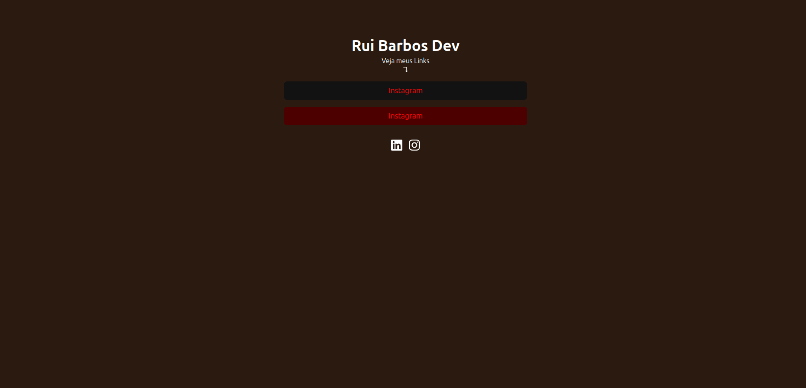

<p align="center">
  <p>Page home</p>
  
  <hr>
  <p>Page login</p>
  
  <hr>
  <p>Page admin</p>
  
  <p>Page admin/social</p>
</p>

🧩 Sobre o Projeto

Esse projeto é um mini sistema de links personalizados, parecido com o Linktree, feito em React + Firebase.
O usuário pode criar, listar e deletar links dentro de uma área administrativa protegida por login.

🚀 Como funciona
🔹 Página Inicial (/)

Mostra todos os links cadastrados no banco de dados, com as cores definidas no painel.
Também exibe ícones com as redes sociais cadastradas (Instagram, LinkedIn, etc).

🔹 Login (/login)

Tela simples onde o usuário faz login com email e senha.
Após o login, é redirecionado automaticamente para a área admin.

🔹 Área Administrativa (/admin)

Somente acessível para quem estiver logado.
Aqui o usuário pode:

Cadastrar novos links (com nome, URL e cores personalizadas);

Visualizar em tempo real os links já existentes;

Deletar links que não quiser mais.

🔹 Rota Protegida (Private.tsx)

Garante que apenas usuários autenticados possam acessar o painel admin.
Se o usuário não estiver logado, ele é mandado de volta para o /login.

🔹 Página 404 (*)

Mostra uma tela simples informando que a página não foi encontrada, com um botão para voltar à página inicial.

🎨 Estilo

O layout usa TailwindCSS e tem um tema escuro de fundo com destaque nas cores dos links.
Arquivo principal de estilo: index.css.


# React + TypeScript + Vite

This template provides a minimal setup to get React working in Vite with HMR and some ESLint rules.

Currently, two official plugins are available:

- [@vitejs/plugin-react](https://github.com/vitejs/vite-plugin-react/blob/main/packages/plugin-react) uses [Babel](https://babeljs.io/) (or [oxc](https://oxc.rs) when used in [rolldown-vite](https://vite.dev/guide/rolldown)) for Fast Refresh
- [@vitejs/plugin-react-swc](https://github.com/vitejs/vite-plugin-react/blob/main/packages/plugin-react-swc) uses [SWC](https://swc.rs/) for Fast Refresh

## React Compiler

The React Compiler is not enabled on this template because of its impact on dev & build performances. To add it, see [this documentation](https://react.dev/learn/react-compiler/installation).

## Expanding the ESLint configuration

If you are developing a production application, we recommend updating the configuration to enable type-aware lint rules:

```js
export default defineConfig([
  globalIgnores(['dist']),
  {
    files: ['**/*.{ts,tsx}'],
    extends: [
      // Other configs...

      // Remove tseslint.configs.recommended and replace with this
      tseslint.configs.recommendedTypeChecked,
      // Alternatively, use this for stricter rules
      tseslint.configs.strictTypeChecked,
      // Optionally, add this for stylistic rules
      tseslint.configs.stylisticTypeChecked,

      // Other configs...
    ],
    languageOptions: {
      parserOptions: {
        project: ['./tsconfig.node.json', './tsconfig.app.json'],
        tsconfigRootDir: import.meta.dirname,
      },
      // other options...
    },
  },
])
```

You can also install [eslint-plugin-react-x](https://github.com/Rel1cx/eslint-react/tree/main/packages/plugins/eslint-plugin-react-x) and [eslint-plugin-react-dom](https://github.com/Rel1cx/eslint-react/tree/main/packages/plugins/eslint-plugin-react-dom) for React-specific lint rules:

```js
// eslint.config.js
import reactX from 'eslint-plugin-react-x'
import reactDom from 'eslint-plugin-react-dom'

export default defineConfig([
  globalIgnores(['dist']),
  {
    files: ['**/*.{ts,tsx}'],
    extends: [
      // Other configs...
      // Enable lint rules for React
      reactX.configs['recommended-typescript'],
      // Enable lint rules for React DOM
      reactDom.configs.recommended,
    ],
    languageOptions: {
      parserOptions: {
        project: ['./tsconfig.node.json', './tsconfig.app.json'],
        tsconfigRootDir: import.meta.dirname,
      },
      // other options...
    },
  },
])
```
